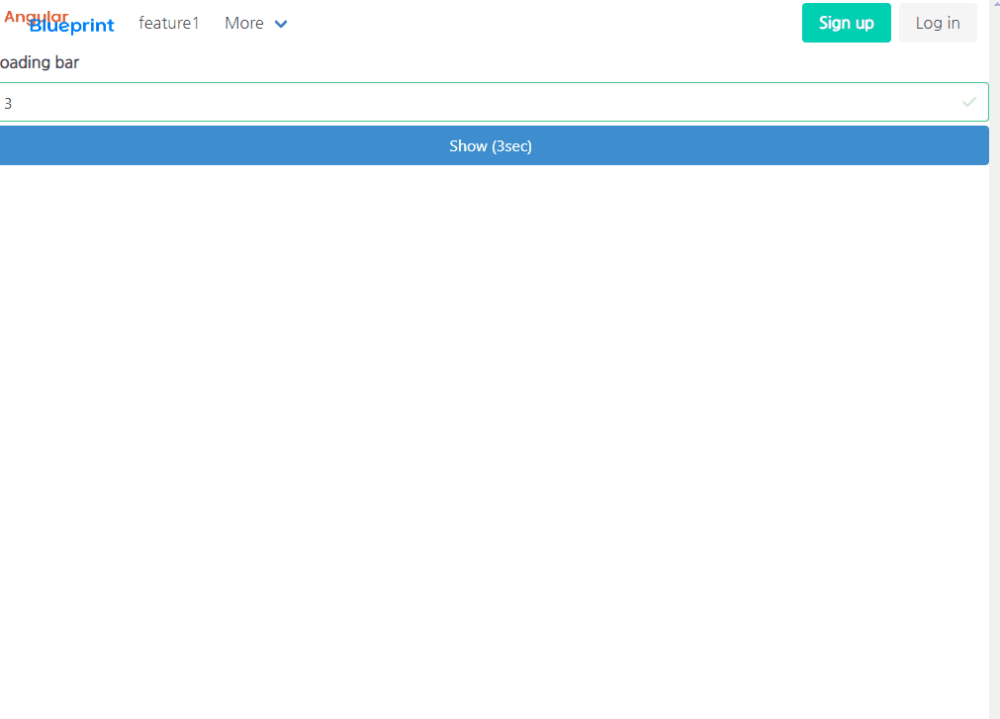

# Angular Blueprint

This project was generated with [Angular CLI](https://github.com/angular/angular-cli) version 15.0.0.




## Library

### Style

- CSS Framwork : [Bulma](https://bulma.io)
- Icon : [Font Awesome 5 Free](https://www.npmjs.com/package/@fortawesome/fontawesome-free)
- Font : [Nanum Gothic](https://fonts.google.com/specimen/Nanum+Gothic?query=nanum#styles)

### Javascript

- Date : [date-fns](https://date-fns.org)

#### Optional (Not installed)

- CSS Framwork : [Angular Meterial](https://material.angular.io)
  - It's not compatible with Bulma

- i18n : [ngx-translate](https://github.com/ngx-translate/core)
- Chart/Graph : [angular-plotly](https://github.com/plotly/angular-plotly.js)
- Richful Editor : [ngx-summernote](https://github.com/lula/ngx-summernote)
- Pagination : [ngx-bulma-pagination](https://github.com/ledyx/ngx-bulma-pagination)
- Util : [Lodash](https://lodash.com)

## File Structure

- [Angular Style Guide - Folders-by-feature structure](https://angular.io/guide/styleguide#folders-by-feature-structure)
- [Angular - folder and file structure example](https://angular.io/guide/styleguide#file-tree)
- [Angular Right File Structure and Best Practices](https://medium.com/@shijin_nath/angular-right-file-structure-and-best-practices-that-help-to-scale-2020-52ce8d967df5)

## Installation & Configuration

[See details (Korean)](Configuration.md)

# Implementations

- The loading bar is visible at the top when the page is moved.
  - [Loading service/ts/html/css](src/app/shared/components/loading)
  - [AppModule](src/app/app.module.ts)

- Scroll to the top when an element with the 'a' tag or the 'appScrollTop' directive is clicked.
  - [ScrollTopDirective](src/app/shared/directives/scroll-top.directive.ts)

- Some example components
  - [Input - FormControl](src/app/shared/components/form-controls/input/input.component.ts)
  - [Table](src/app/features/feature1/pages/page1)

## Development

```
ng serve --open
```

## Build

```
ng build --configuration production
```